# Project 6: Web Solution With WordPress

## Prepare a Web server:

Launch an EC2 instance that will serve as the Web Server. Using Red Hat for this Project.
Create 3 volumes for the Web Server EC2 where each is 10 GiB.

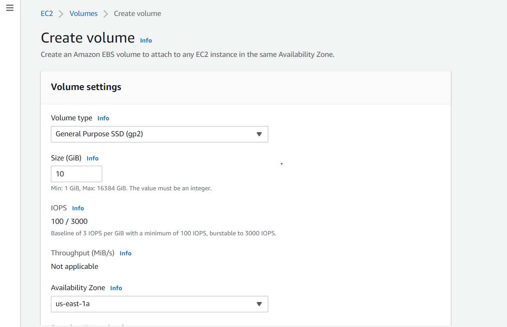

Attach all three volumes one by one to your Web Server EC2 instance

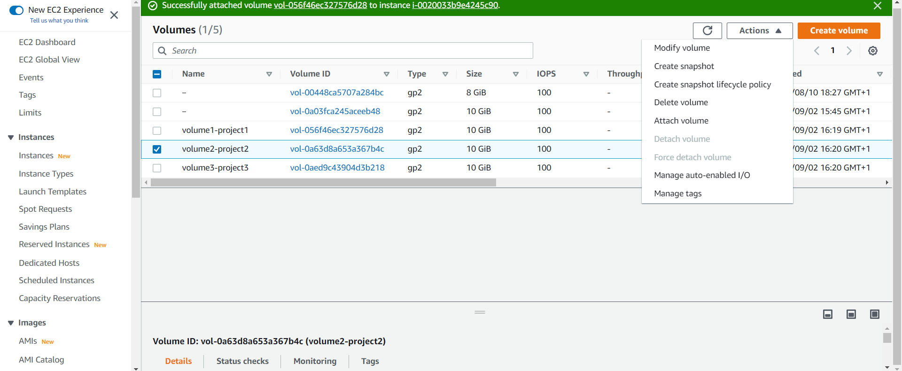

Confirm storage on the EC2 dashboard:

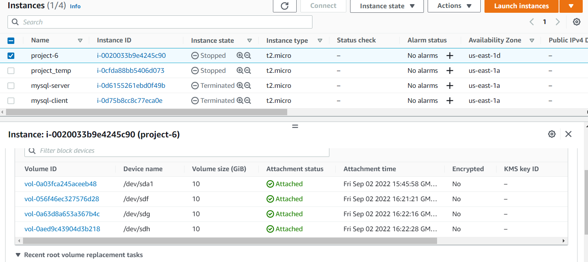

Go to the Linux terminal and use `lsblk` to also confirm:

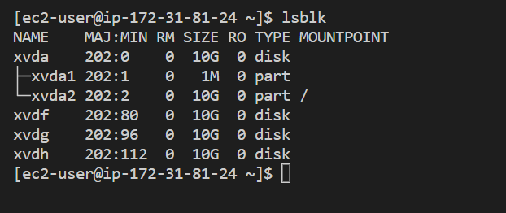

Use `df -h` command to see all mounts and free space on your server:

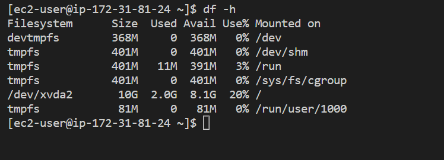

Use gdisk utility to create a single partition on each of the 3 disks:

`sudo gdisk /dev/xvdf`

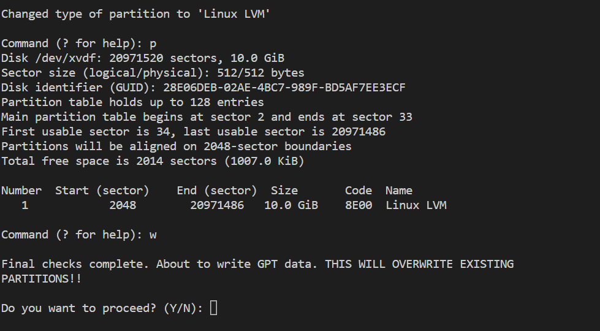

Note: inserting the n command to create the partition is missing in the documentation

Do the same for xvdg and xvdf

Use `lsblk` utility to view the newly configured partition on each of the 3 disks:

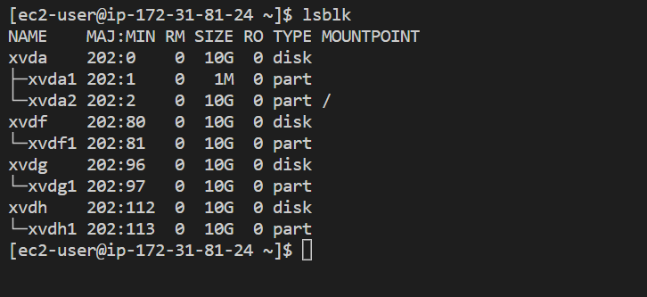

Install lvm2 package using `sudo yum install lvm2`:

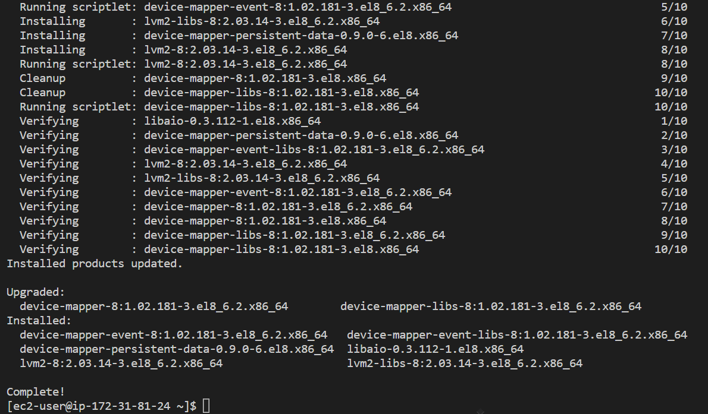
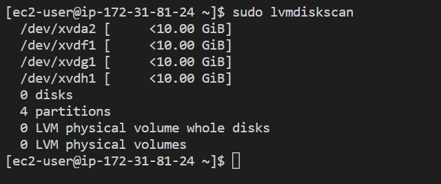

Use pvcreate utility to mark each of 3 disks as physical volumes to be used by LVM using these codes:

`sudo pvcreate /dev/xvdf1`
`sudo pvcreate /dev/xvdg1`
`sudo pvcreate /dev/xvdh1`

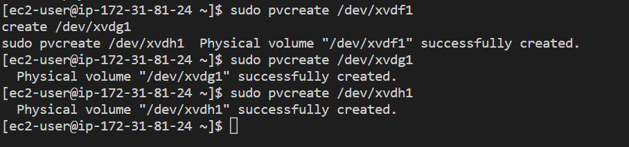

Verify that the Physical volume has been created successfully by running `sudo pvs`:

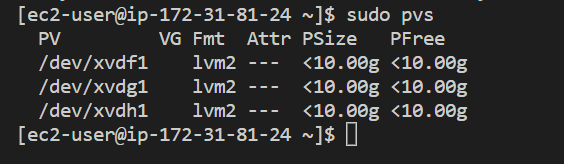

Use vgcreate utility to add all 3 PVs to a volume group (VG). Name the VG webdata-vg:

`sudo vgcreate webdata-vg /dev/xvdh1 /dev/xvdg1 /dev/xvdf1`

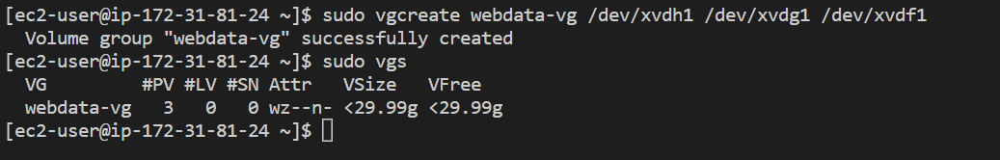

Use lvcreate utility to create 2 logical volumes. apps-lv (Use half of the PV size), and logs-lv Use the remaining space of the PV size:

`sudo lvcreate -n apps-lv -L 14G webdata-vg`
`sudo lvcreate -n logs-lv -L 14G webdata-vg`

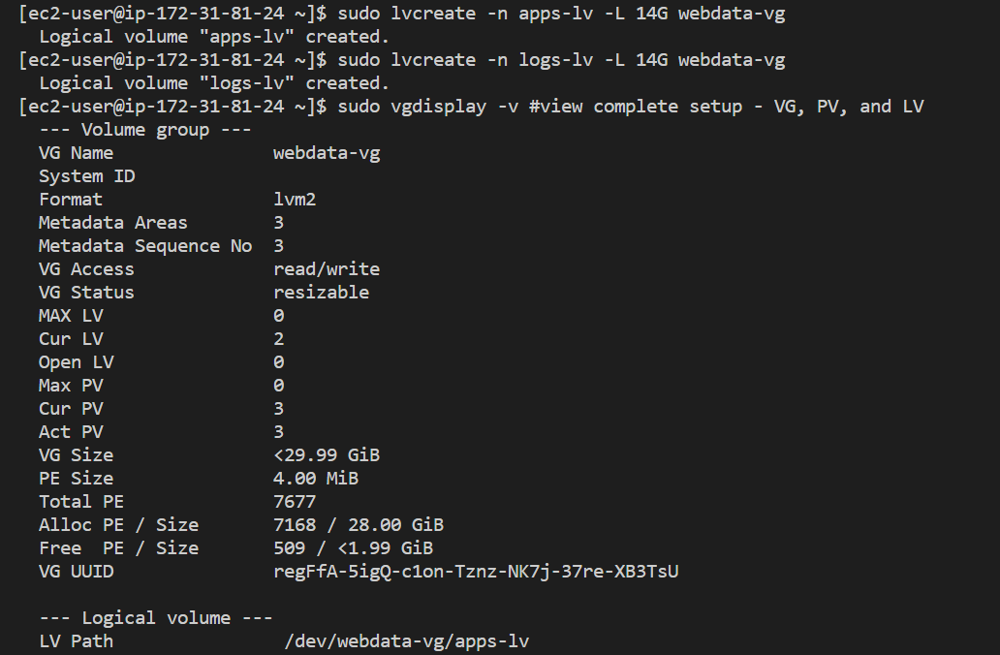

Verify the entire setup:

`sudo vgdisplay -v #view complete setup - VG, PV, and LV`
`sudo lsblk` 

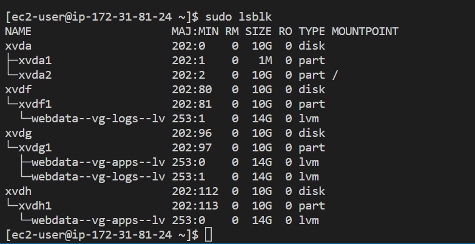

Use mkfs.ext4 to format the logical volumes with ext4 filesystem:

`sudo mkfs -t ext4 /dev/webdata-vg/apps-lv`
`sudo mkfs -t ext4 /dev/webdata-vg/logs-lv`

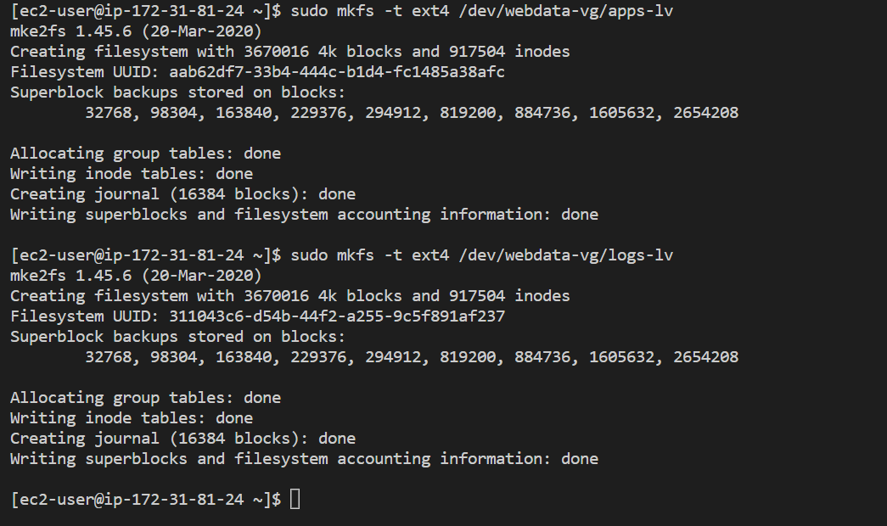

Create /var/www/html directory to store website files:

`sudo mkdir -p /var/www/html`

Create /home/recovery/logs to store backup of log data:

`sudo mkdir -p /home/recovery/logs`

Mount /var/www/html on apps-lv logical volume:

`sudo mount /dev/webdata-vg/apps-lv /var/www/html/`

Use rsync utility to backup all the files in the log directory /var/log into /home/recovery/logs

`sudo rsync -av /var/log/. /home/recovery/logs/`

Mount /var/log on logs-lv logical volume:

`sudo mount /dev/webdata-vg/logs-lv /var/log`

Restore log files back into /var/log directory:

`sudo rsync -av /home/recovery/logs/. /var/log`

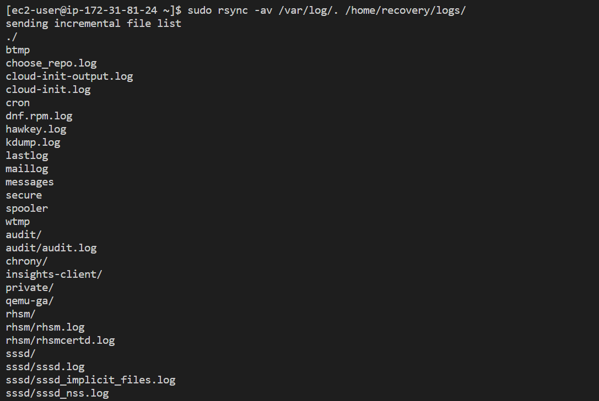

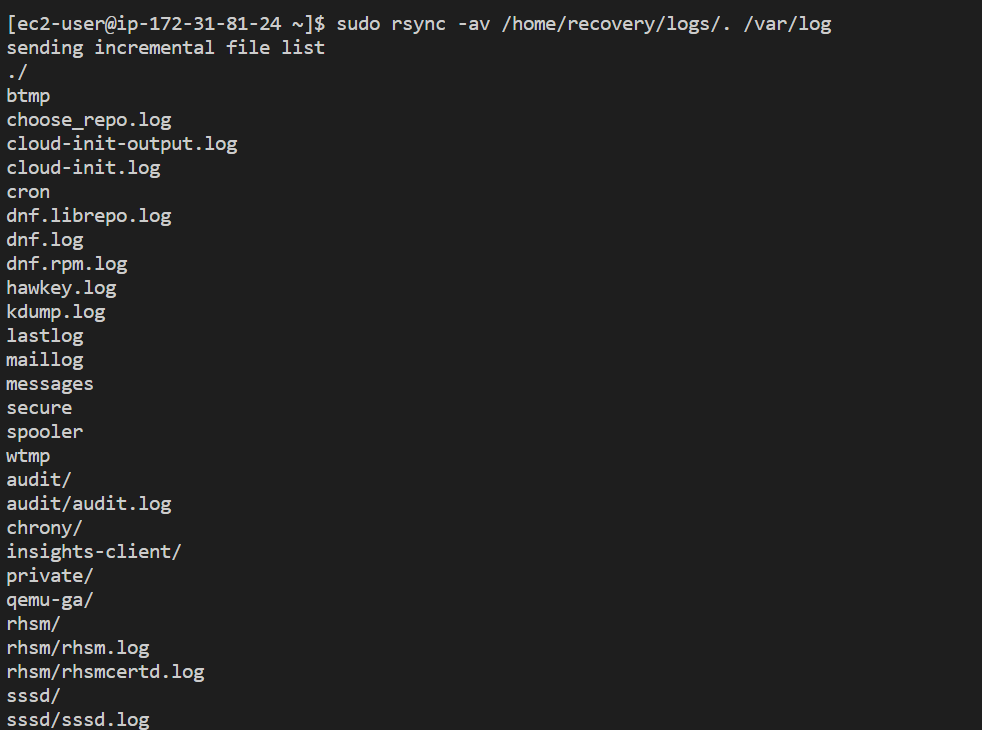

## Update the `/etc/fstab` file

The UUID of the device will be used to update the /etc/fstab file:

`sudo blkid`

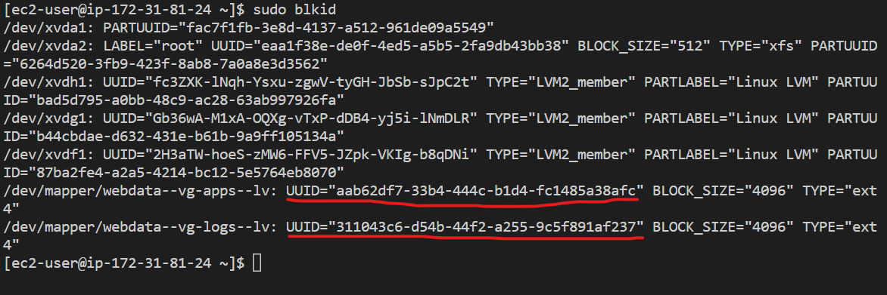

`sudo vi /etc/fstab`

Update /etc/fstab in this format using the previous UUID and make sure to remove the leading and ending quotes:

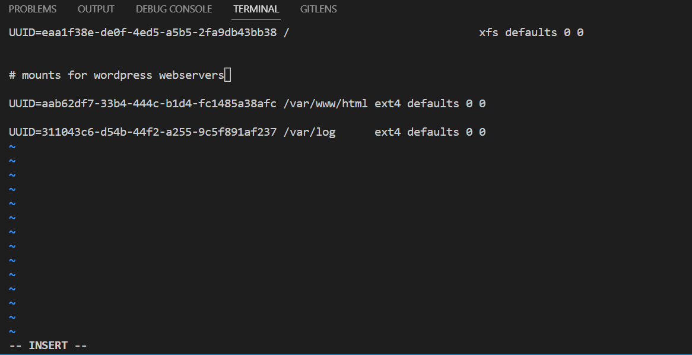

Test the configuration and reload the daemon:

`sudo mount -a`
`sudo systemctl daemon-reload`

Verify the setup by running `df -h`:

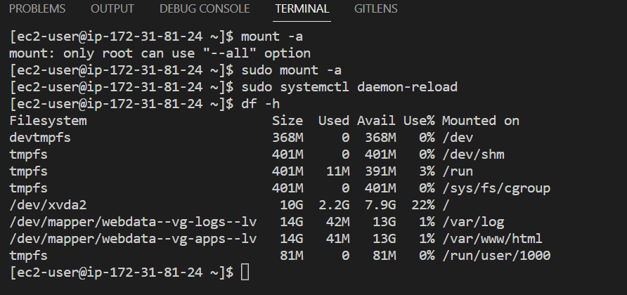

Now Prepare the Database server:

Launch a second Red Hat EX2 instance and repeat the same steps for the Web Server previously but instead of apps-lv create db-lv and mount it /db directory instead of /var/www/html

Note: when I created the new instance, I had created the volumes first. So to make the same subset, I added the subset east-1a to the new instance to be able to attach the volumes instead of chossing default:

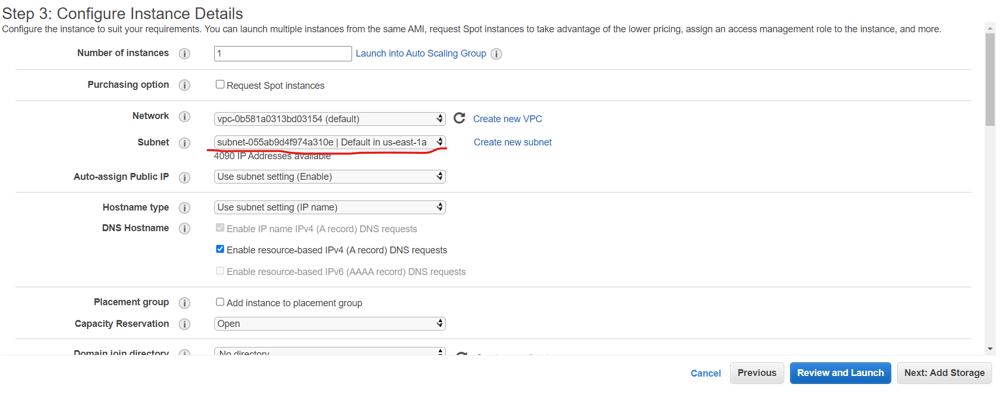
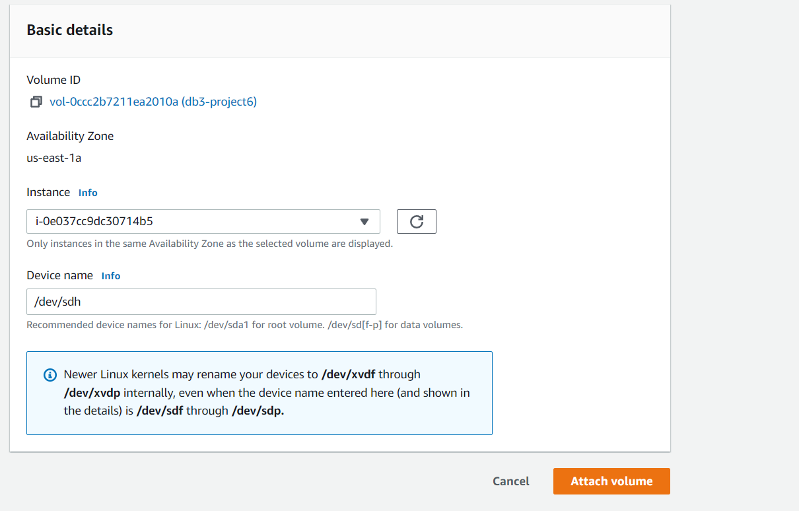

Update the repo:

`sudo yum update`

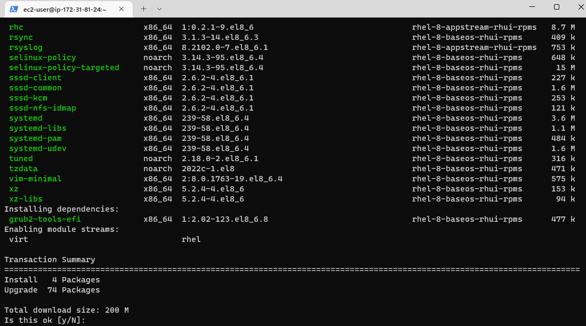

Now install WordPress on Web Server EC2:

Install wget, Apache and it’s dependencies:

`sudo yum -y install wget httpd php php-mysqlnd php-fpm php-json`

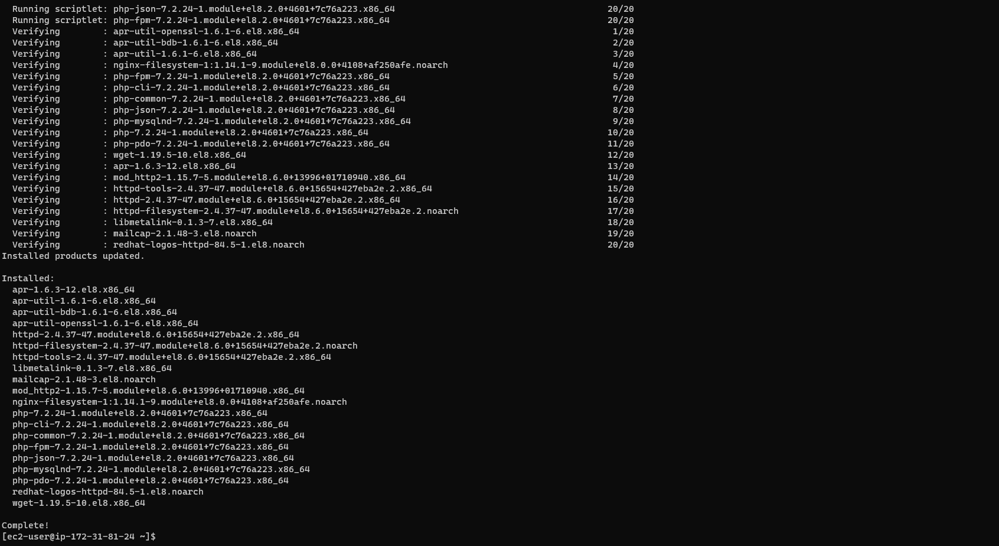

Start Apache:

`sudo systemctl enable httpd`
`sudo systemctl start httpd`

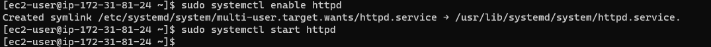

Install PHP and it’s depemdencies:

`sudo yum install https://dl.fedoraproject.org/pub/epel/epel-release-latest-8.noarch.rpm`
`sudo yum install yum-utils http://rpms.remirepo.net/enterprise/remi-release-8.rpm`
`sudo yum module list php`
`sudo yum module reset php`
`sudo yum module enable php:remi-7.4`
`sudo yum install php php-opcache php-gd php-curl php-mysqlnd`
`sudo systemctl start php-fpm`
`sudo systemctl enable php-fpm`
`setsebool -P httpd_execmem 1`

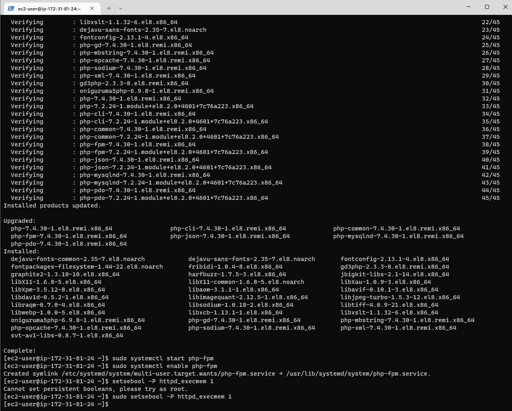

Retart Apache:

`sudo systemctl restart httpd`

Download wordpress and copy wordpress to var/www/html:

`mkdir wordpress`
`cd   wordpress`
`sudo wget http://wordpress.org/latest.tar.gz`
`sudo tar xzvf latest.tar.gz`
`sudo rm -rf latest.tar.gz`
`cp wordpress/wp-config-sample.php wordpress/wp-config.php`
`cp -R wordpress /var/www/html/`

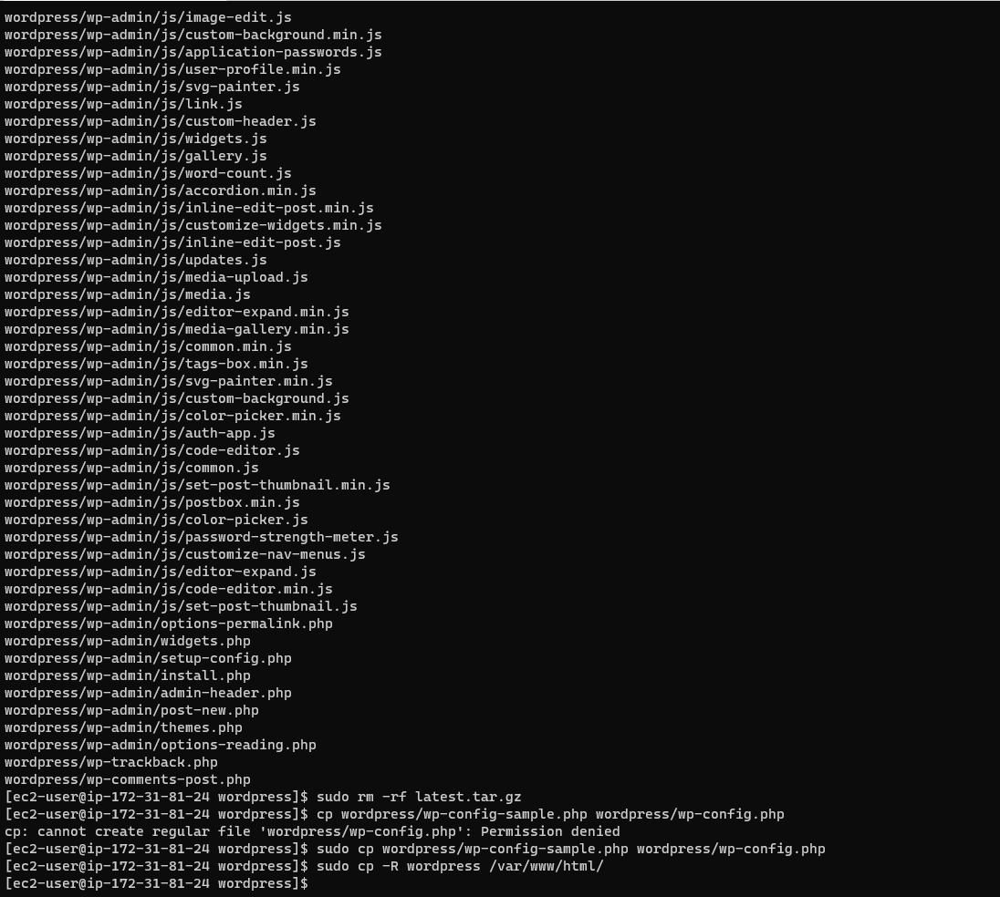

Configure SELinux Policies:

`sudo chown -R apache:apache /var/www/html/wordpress`
`sudo chcon -t httpd_sys_rw_content_t /var/www/html/wordpress -R`
`sudo setsebool -P httpd_can_network_connect=1`

Now install MySQL on the DB Server EC2:

Make sure the repo is updated if you haven't already by `sudo yum update`

Install mysql:

`sudo yum install mysql-server`

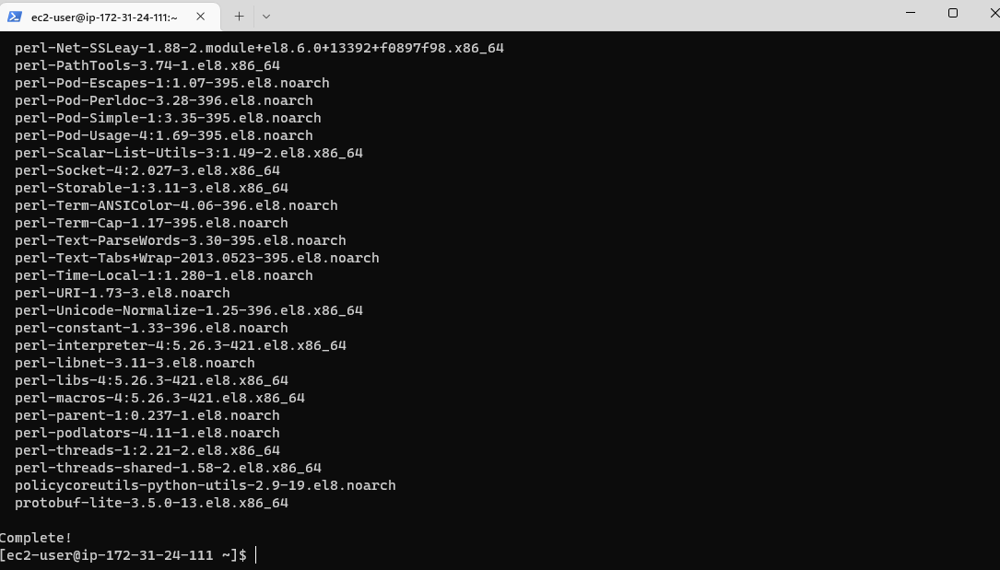

Verify that the service is up and running by using `sudo systemctl status mysqld`

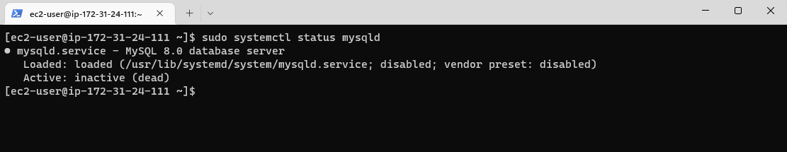

Restart the service and enable it so it will be running even after reboot:

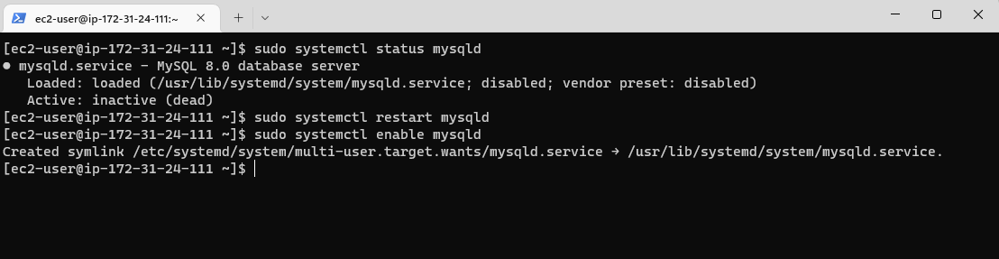

Configure DB to work with WordPress using these:
```
sudo mysql
CREATE DATABASE wordpress;
CREATE USER `myuser`@`<Web-Server-Private-IP-Address>` IDENTIFIED BY 'mypass';
GRANT ALL ON wordpress.* TO 'myuser'@'<Web-Server-Private-IP-Address>';
FLUSH PRIVILEGES;
SHOW DATABASES;
exit
```
Note: make use it is the correct webserver private IP address

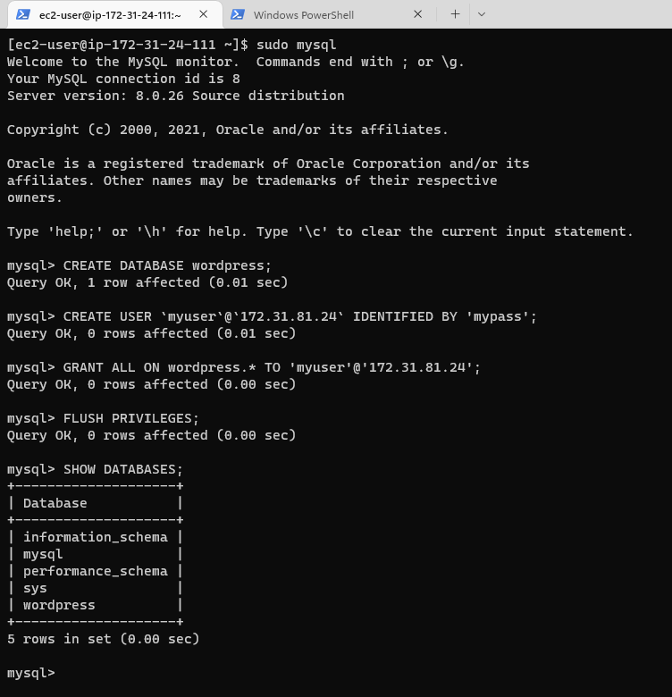

Next configure WordPress to connect to remote database:

Note to not forget to open MySQL port 3306 on DB Server EC2

Edit inbound rules to allow access to the Database only from the  web server private IP address:

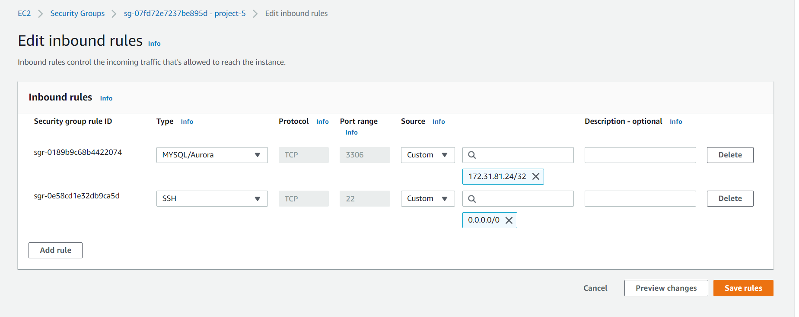

Next install mysql client and test the connection from web server to database:

`sudo yum install mysql`
`sudo mysql -u myuser -p -h <DB-Server-Private-IP-address>`

Verify if you can successfully execute SHOW DATABASES; command and see a list of existing databases:

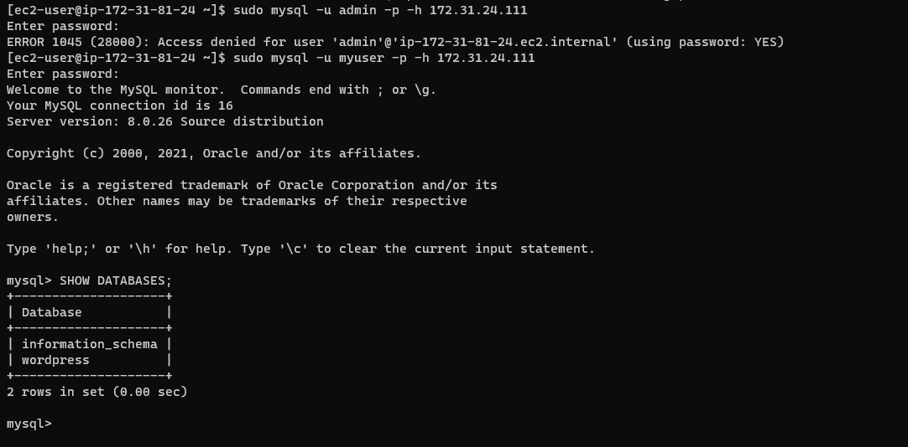

Change permissions and configuration so Apache could use WordPress (NOTE this is no longer viewable in the documentation which slowed down my process)

`sudo chown _R apache:apache /var/www/html/wordpress`
`sudo chcon -t httpd_sys_rw_content_t /var/www/wordpress -R`
`sudo setsebool -P httpd_can_network_connect=1`

Enable TCP port 80 in Inbound Rules configuration for the Web Server EC2:

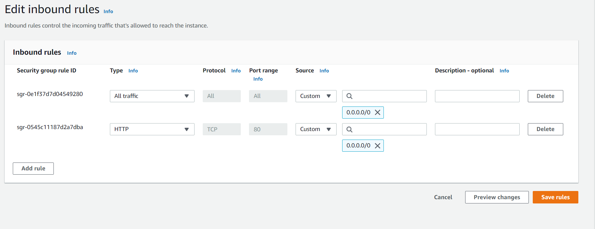

Try to access from a browser the link to the WordPress http://<Web-Server-Public-IP-Address>/wordpress/


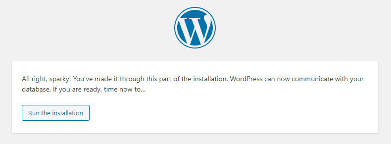

Note to use this link to have latest php version:

https://www.tecmint.com/install-lamp-on-centos-8/

Done